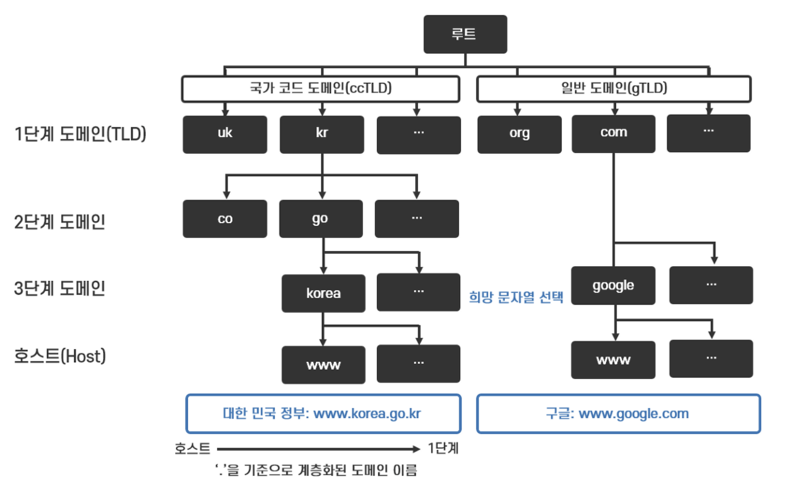
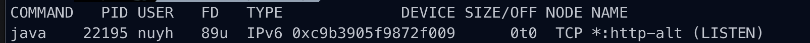

# Ch1 웹 브라우저가 메시지를 만든다
### HTTP 리퀘스트 메시지를 작성한다
```http
프로토콜 + 호스트 + 경로
https://velog.io/@nuyh99
```
* 위와 같은 URL을 브라우저가 해독
* HTTP 메서드 종류 (출처 [Mozilla](https://developer.mozilla.org/ko/docs/Web/HTTP/Methods))
> **GET** 메서드는 특정 리소스의 표시를 요청합니다. GET을 사용하는 요청은 오직 데이터를 받기만 합니다.
> 
> **HEAD** 메서드는 GET 메서드의 요청과 동일한 응답을 요구하지만, 응답 본문을 포함하지 않습니다.
> 
> **POST** 메서드는 특정 리소스에 엔티티를 제출할 때 쓰입니다. 이는 종종 서버의 상태의 변화나 부작용을 일으킵니다.
> 
> **PUT** 메서드는 목적 리소스 모든 현재 표시를 요청 payload로 바꿉니다.
> 
> **DELETE** 메서드는 특정 리소스를 삭제합니다.
> 
> **CONNECT** 메서드는 목적 리소스로 식별되는 서버로의 터널을 맺습니다.
> 
> **OPTIONS** 메서드는 목적 리소스의 통신을 설정하는 데 쓰입니다.
> 
> **TRACE** 메서드는 목적 리소스의 경로를 따라 메시지 loop-back 테스트를 합니다.
> 
> **PATCH** 메서드는 리소스의 부분만을 수정하는 데 쓰입니다.
* HTTP Request, Response
  
* 헤더에는 다양한 정보가 존재
    * 인증, 캐싱, 클라이언트 힌트, 조건부, 연결 관리, 컨텐츠 협상, 제어, 쿠키, CORS, 추적 안함, 다운로드, 메시지 바디 정보, 프록시, 리다이렉트, 요청 컨텍스트, 응답 컨텍스트, …
* 응답의 태그를 기준으로 브라우저에 파싱
    * img 등의 태그는 해당 영역을 비워두고 다시 서버에 해당 자원 GET 요청

### 웹 서버의 IP 주소를 DNS 서버에 조회한다
* 서브넷팅 사용(네트워크 주소, 호스트 주소의 분리)
* 브로드캐스팅, 게이트웨이, 서브넷 등의 기본 IP
* 도메인 주소와 IP를 매핑해둬서 유저가 기억하기 쉽게 함
* socket 라이브러리의 `getHostByName` 함수로 조회 가능(DNS 클라이언트인 리졸버 사용)
* 계층형 도메인 구조 (루트 도메인은 도메인 명이 없지만 전체를 이어주기 위해 존재)
  
* 하위 도메인에 대한 정보를 상위 도메인이 가짐으로써 관리
* 캐싱도 가능
* DNS 설정에 따라서 반복적 또는 재귀적으로 질의(DNS Request 헤더에 Flag 존재)

### 전 세계의 DNS 서버가 연대한다
* DNS 메시지의 주요 정보: 도메인 네임, IN, 레코드 타입
* 레코드 타입 종류
> A: IPv4
> AAAA: IPv6
> CNAME: 별칭
> MX: 메일
> PTR: 다른 DNS 레코드를 가리킴, Reverse DNS(IP를 통해서 도메인을 찾을 때)
> SOA: 도메인 서버 자체의 메타 데이터(관리자의 이메일 주소, 도메인이 마지막으로 업데이트된 시간, 새로 고침 사이에 서버가 대기해야 하는 시간)
> NS: 해당 도메인의 레코드를 가지고 있는 서버들

### 프로토콜 스택에 메시지 송신을 의뢰한다
* Socket 라이브러리를 사용해서 프로세스 간 통신
    * TCP 소켓 또는 UDP 소켓 생성(Descriptor 사용)
        * 현재 컴퓨터의 원하는 포트 또는 랜덤 포트에 소켓 바인딩
    * 서버 측의 IP, 포트 번호를 사용해서 연결 시도
    * 수신 데이터는 버퍼에 저장(byte로 받아서 저장)
    * 소켓 close
* ex: 스프링을 띄우면 톰캣이 HTTP 서버로 동작, TCP 소켓이 8080 포트에 바인딩 돼서 LISTEN 중
  
