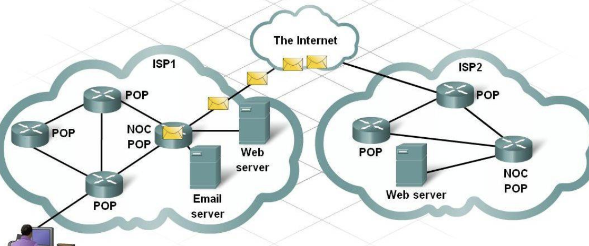

# Ch4 엑세스 회선을 통해 인터넷의 내부로
### ADSL 기술을 이용한 액세스 회선의 구조와 동작
* 수많은 라우터가 존재
* 대부분은 같지만 인터넷 접속용 라우터의 패킷 송신 동작은 이더넷과 조금 다름
    * 인터넷 접속용은 액세스 회선의 규칙에 따라 동작 수행
* 액세스 회선: 가정, 회사의 LAN -> 인터넷
    * ADSL, FTTH, CATV, 전화 회선, ISDN 등
* ADSL 예시
    * 라우터에서 패킷 받으면
    * ATM 셀로 분할
    * 전기 신호로 변환해서 송출
    * 전화국에서 받고 터널링을 통해 인터넷에 연결
* QAM(Quadrature Amplitude Modulation) 방식으로 신호화
    * 진폭 변조(ASK), 위상 변조(PSK) 방식의 결합
    * 각각의 변조 방식 단계 수에 따라 통신 속도가 높아짐
        * 단계 수가 너무 많아지면 판별하기 어려움
* 주파수를 분리해서 여러 파 합성
* 잡음이 없는 주파수에는 다수의 비트 대응시키고, 잡음이 많으면 소수의 비트 대응
* QAM의 단계, 단계별 대응 비트 수, 분리된 파의 갯수에 의해 전체 전송 속도 결정
* 업로드와 다운로드 속도가 다른데 업로드는 26개의 파, 다운로드는 223개의 파를 사용
    * 업로드는 낮은 주파수, 다운로드는 높은 주파수의 파들을 사용
    * 주파수가 높을 수록 감쇠가 크고 잡음의 영향을 받기 쉬우므로 속도가 떨어지기 쉬움
* 스플리터
    * ADSL에서 전기 신호로 변환된 셀은 스플리터에서 전화의 음성 신호와 섞임
    * 반대로 사용자에게 신호가 들어올 때는 전화 신호와 ADSL의 신호를 나누는 역할
    * 전화 신호는 주파수가 낮고, ADSL 신호는 주파수가 높음
    * 서로를 격리해서 잡음을 줄임
* ADSL -> 스플리터 -> 전화 케이블 -> 건물의 옥내 배선반 IDF or MDF
    * 이후 전력선이 가설되어 있는 전주의 전화 케이블로 들어감
    * 금속 케이블, 여러 회선이 묶여서 하나의 굵은 케이블이 됨
* 전화국에 도착한 신호 -> MDF -> 스플리터 -> DSLAM(전화국용 ADSL 집합 모뎀)
    * 가정용 ADSL 모뎀은 이더넷 인터페이스가 있지만 DSLAM은 모두 ATM 인터페이스
    * 셀의 형태 그대로 후방의 라우터와 통신
    * DSLAM 이후 BAS(Broadband Access Server)라는 패킷 중계 장치에 도착
    * 이후 MAC, PPPoE 헤더를 버리고, PPP 헤더 이후 부분을 사용해서 터널링으로 인터넷 연결

### 광섬유를 이용한 액세스 회선(FTTH)
* FTTH는 광섬유를 이용한 액세스 회선
    * 코어, 클래드를 통한 굴절(전반사)
* ADSL은 다수의 주파수를 이용하지만 광신호는 빛이 켜지면 1, 꺼지면 0
    * 	밝으면 높은 전압, 어두우면 낮은 전압
* 싱글 모드는 하나의 빛, 멀티 모드는 복수의 빛
    * 멀티 모드는 반사 횟수가 많은 빛일 수록 늦게 도착하므로 신호의 변형이 생김
    * 싱글 모드는 하나의 빛이므로 신호의 변형이 없음
    * 따라서 싱글 모드가 케이블 길이를 더 길게 할 수 있음
    * 멀티 모드는 여러 개의 빛을 쏘므로 광원이 약해도 됨(가격 절감)
    * 멀티 모드 광섬유는 한 건물 안 연결
    * 싱글 모드 광섬유는 멀리 떨어진 건물 사이 연결
    * FTTH는 싱글 모드 사용
* 사용자 이더넷 전기 신호 -> 미디어 컨버터(광신호로 변환) -> 광섬유 -> 미디어 컨버터 -> BAS -> 터널링
* 파장이 다른 빛은 프리즘으로 분리가 가능하므로 복수의 광신호 사용 가능
* MAC, PPPoE, PPP 헤더를 사용한 인터넷 접속 방법은 ADSL과 같음

### 액세스 회선으로 이용하는 PPP와 터널링
* 전화 회선이나 ISDN으로 인터넷에 연결할 때의 PPP 동작
    * 프로바이더의 액세스 포인트에 전화를 걸고 받으면(다이얼업)
    * ID, PW를 입력해서 PPP 작성
    * RAS(Remote Access Server)가 검사하고 IP 주소 등의 설정 정보 반송
    * 사용자의 PC는 받은 정보로 글로벌 IP 주소 설정
* ADSL, FTTH도 PC에 글로벌 IP 주소가 없으면 인터넷에 접속할 수 없음
    * 유저와 BAS를 케이블로 고정 접속하기 때문에 ID, PW가 필요 없음
    * 하지만 사용자명에 따라 프로바이더를 전환할 수 있으므로 PPP를 가지면 편리함
    * 따라서 액세스 회선 사업자는 ADSL, FTTH에도 PPP 구조 사용
* 송수신의 신호를 맞추는 Preamble이나 에러 감지하는 FCS가 없으므로 PPP를 그대로 송신 불가능
    * 따라서 HDLC 프로토콜에 PPP 메시지를 저장해서 송신
    * HDLC 프로토콜은 전용선이라는 통신 회선으로 패킷을 운반하기 위한 사양
    * 전화 회선이나 ISDN으로 인터넷에 접속할 때는 HDLC를 일부 수정해서 사용
        * HDLC에 PPP 메시지를 붙여서 보냄
        * HDLC는 PPP 메시지 송수신용
* ADSL이나 FTTH는 HDLC를 사용하는 형태로 돼있지 않기 때문에 PPP를 그대로 쓸 수 없음
    * HDLC 대신 이더넷 패킷을 사용해서 PPP 메시지 송수신
    * 따라서 PPPoE
* 결론적으로 다이얼업(전화 회선, ISDN)과 마찬가지로 ADSL, FTTH에서도 PPP 메시지 운반 가능
* 정리하면 PPP(ID, PW 전송용) 메시지를 HDLC나 이더넷 패킷을 사용해서 RAS와 송수신
* BAS가 사용자로부터 신호를 받으면 터널링을 통해 프로바이더에게 전송
    * BAS와 프로바이더 사이에 터널 생성
    * 터널링은 TCP 커넥션을 사용하거나 캡슐화해서 송수신
* 액세스 회선 전체의 동작 정리
    * 사용자의 인터넷 접속용 라우터에 프로바이더가 할당한 ID, PW를 등록
    * 라우터가 PPPoE의 Discovery라는 구조에 따라 BAS 찾음(like 브로드캐스팅을 통한 ARP)
    * 이를 통해 BAS의 MAC 주소 획득
    * CHAP 또는 PAP 등의 PW 암호화 방식을 사용해서 BAS와 통신
        * ID, PW 확인 후 BAS에서 TCP/IP 설정 정보 통지
            * Public IP, DNS IP, Gateway IP
        * 라우터에 설정
    * 인터넷 송수신 준비 완료
    * 인터넷 액세스하면 PPPoE를 통해 BAS와 패킷 송수신
* PPPoE 이외의 방식
    * PPPoA(over ATM)
        * ADSL 액세스 회선 방식
        * PPPoE에서는 PPP를 이더넷 패킷에 저장한 후 셀로 변환
        * PPPoA에서는 PPP를 그대로 셀로 변환
        * 이더넷 패킷은 MAC 헤더가 필요한데 그 부분이 없으므로 효율적
    * DHCP(Dynamic Host Configuration Protocol)
        * PPPoE는 이더넷 패킷을 쓰므로 MTU가 낮아지고, PPPoA는 라우터와 ADSL 모뎀을 분리할 수 없음
        * PPP를 사용해야 하기 때문에 발생하는 문제들이지만 DHCP는 PPP를 사용하지 않음
        * 사내 LAN에서 여러 PC들에게 TCP/IP 설정을 통지하기 위해 사용됨
        * ID, PW를 확인하지 않으므로 사용자별 프로바이더 전환 불가능
        * 인터넷 패킷을 그대로 주고 받으므로 MTU 효율적

### 프로바이더의 내부
* 인터넷의 실체는 다수의 프로바이더 네트워크를 연결한 것
* 사용자의 ADSL, FTTH 등의 액세스 회선은 계약한 프로바이더의 설비에 연결(POP)
  
* 여러 POP(Point Of Presence)가 모이는 NOC(Network Operation Center)
* NOC에서 다른 프로바이더 등으로 라우팅
* 건물 안에서는 TP 케이블을 사용하여 기기를 보통 접속하지만 프로바이더의 네트워크는 패킷의 양이 초과하는 경우도 있음
    * 이때 광섬유 케이블 사용
* 건물 밖의 멀리 떨어진 NOC나 POP에 연결할 때는 광섬유를 사용
    * 매설이 필요하므로 막대한 비용 필요 + 유지 관리 비용
    * 광섬유를 소유한 프로바이더는 극소수의 대형 프로바이더
* 광섬유가 없는 프로바이더는 있는 프로바이더에게 통신 회선 대여

### 프로바이더를 경유하여 흐르는 패킷
* 사용자의 라우터부터 프로바이더의 라우터까지 모든 라우터는 항상 경로 정보 최신화
    * BGP(Border Gateway Protocol) 등의 알고리즘으로 정보 교환
* 중계 대상은 NOC, POP 등 어떤 것일 수도 있음
* 하지만 프로바이더끼리 정보 교환을 하려면 모든 프로바이더가 서로 연결돼야함 -> IX 설비 등장
* IX(Internet eXchange)에 프로바이더들이 1:N으로 연결되고, 따라서 프로바이더들은 IX에만 접속하면 다른 프로바이더 연결 가능
